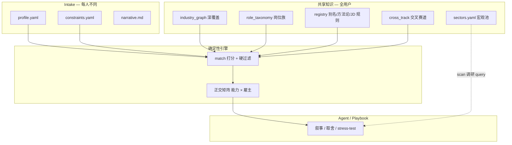

# 用户架构与扩展策略

> 北斗星（Beidou）如何用**同一套流水线 + 分层数据**服务不同领域、不同背景的用户；以及「继续扩展行业图谱」在什么条件下有价值。

相关文档：[matching-engine.md](matching-engine.md) · [user-journey.md](user-journey.md) · [phase-3.md](phase-3.md) · [schema-v2.2.md](schema-v2.2.md)

---

## 1. 设计原则

北斗星是 **pre-application 择业决策引擎**，不是行业百科全书，也不是替用户选方向的推荐系统。

**北极星**：分析 **profile × 行业结构 × 趋势 × 竞争**，返回 **多条、有证据、可执行** 的定位选项；系统 **从不** 替用户做最终选择。

**个性化来源**：

| 层 | 数据 | 谁不同 |
|----|------|--------|
| 个人 | `profile.yaml`、`constraints.yaml`、`narrative.md` | 每个用户 |
| 共享 | `sectors.yaml`、`industry_graph.yaml`、`role_taxonomy*.yaml`、`cross_track.yaml`、`registry/*.yaml` | 全用户 |
| 引擎 | `match.py`、`cross_track.py`、`eligibility.py` | 确定性规则，无 per-user 硬编码 |
| 叙事 | `playbooks/`、Agent 对话 | 人工/Agent 补全 fit_rationale、opens_up、costs |

扩展行业图谱的价值，取决于它落在哪一层、修复哪类**可复现的失败**——而不是「sectors 列表写满」。

---

## 2. 数据分层与职责



### 各层解决什么问题

| 数据文件 | 模型 | 职责 | 不扩展时的典型失败 |
|----------|------|------|-------------------|
| `sectors.yaml` | 宏观行业池 | **scan** 阶段生成检索方向；用户调研广度 | Agent 靠对话猜行业，信号漏检 |
| `industry_graph.yaml` | `IndustryGraph` | 价值链深浅、trap、`domain_markers`、`market_saturation` | 跨行业误推；饱和/逆风不可见 |
| `role_taxonomy.yaml` + `role_taxonomy_public.yaml` | `RoleTaxonomy` | 岗位族 × 图谱节点 × 雇主轴；资格关字段 | 矩阵稀疏、空单元格 |
| `cross_track.yaml` | `CrossTrackFile` | 方法论可迁移 + 行业语境缺口（全用户共享） | 只看到饱和主赛道，看不到新兴相邻 |
| `skill_aliases.yaml` 等 registry | 注册表 | 技能别名、能力轴命名、方法论 marker、JD 关联 | 误匹配、Python 硬编码、难维护 |
| `signals/*.yaml` | `Signal` | 竞争密度、顺风依据（须 source + date） | wind/竞争仅靠默认启发 |

**按需深覆盖**：宏观趋势可长期留在 `sectors.yaml` + `signals/`；只有需要 **match 打分、矩阵出格、饱和/交叉标注** 时，才深化 `industry_graph` + `role_taxonomy`。

---

## 3. 端到端流水线

```
intake → validate（缺口追问）
  ↓
scan-plan（sectors → 检索 query）
  ↓
signals（趋势/竞争，带 source + date）
  ↓
match（taxonomy 遍历 × 硬约束 × 域亲和 × 交叉调整）
  ↓
opportunities 正交矩阵（能力轴 × 雇主轴，Top N）
  ↓
Agent / playbook 3 审阅 narrative
  ↓
（可选 · legacy）execute：jd-analyze · job · track · replan（不在主线，见 docs/phase-3.md）
```

| 阶段 | 命令 / 表面 | 产出 |
|------|------------|------|
| intake | 对话 / `validate` | `profile.yaml`、`constraints.yaml`、`narrative.md` |
| scan | `scan-plan`、`new-signal`、`job add` | `signals/*.yaml` · `saved_jobs.yaml` |
| analyze | `brief` → `match` → `render-opportunities` | `opportunities.yaml` → `opportunities.md` ★核心交付★ |
| execute（legacy） | `render-execution`、`track`、`replan`、`jd-analyze` | 行动手册、投递漏斗、修订建议 —— Phase 3 遗留，不在主线 |

引擎产出的是 **机器初稿**（`opportunities.draft.yaml`）；四层框架的叙事与最终取舍仍在 playbook / Agent 侧。

---

## 4. 用户分型与系统响应

系统用 **同一套 match 逻辑**，靠画像差异与闸门分化输出，不为个人写 Python 规则。

| 用户类型 | 典型画像 | 主要机制 | 交付形态 |
|----------|----------|----------|----------|
| **深耕型** | 港航 OR、pharma 统计、芯片 RTL | `domain_markers` 高亲和 → 主赛道高分；节点 `market_saturation` | 矩阵主表 + 顺风/逆风 |
| **方法论迁移型** | OR/ML 内核强、行业可换 | `cross_track` + `method_patterns`；`cross_track_match_adjustment` 不过度压分 | 主表 + **交叉赛道洞察** |
| **跨界试探型** | 仅 Python+ML、无行业锚 | `unknown_domain_anchor`（默认 0.35）保守；`domain_specific_skills` 门禁 | 浅层 LLM 可进矩阵但生物/化学难误推 |
| **体制内 / 学术型** | 博士、211/非211、博后 | `role_taxonomy_public` + **资格闸门**（eligibility） | 教职/科研/公务员分列；`blocked` 标灰 |
| **约束驱动型** | 低 runway、低风险、只要央企 | `constraints` 硬过滤 + `employer_preference` 墙 | 行/列剔除，不是降分 |
| **JD 驱动型** | 已收藏具体岗位 | `jd_link_rules` + `analyze_saved_job` | 覆盖率、缺口、关联矩阵方向 |

### 关键闸门（防误推）

| 机制 | 配置位置 | 作用 |
|------|----------|------|
| 行业域亲和 | `industry_graph.domain_markers` | 画像与目标行业语境重合度；未知行业用 `method_patterns.unknown_domain_anchor` |
| 别名安全 | `skill_aliases.yaml` + `match._alias_in_text` | 短中文子串不误伤（如「化学」⊂「强化学习」） |
| 交叉赛道 | `cross_track.yaml` + `method_patterns.yaml` | 方法论可迁移 ≠ 行业背景匹配 |
| 赛道饱和 | `industry_graph.market_saturation` | 全用户共享；仅当亲和度 ≥ 50% 或技能匹配 ≥ 55% 时对当前用户生效 |
| 资格关 | `hiring_eligibility_rules.yaml` + taxonomy 字段 | 与 domain fit 正交的 hiring fit（教职/公务员等） |
| 硬约束 | `constraints.yaml` | risk、runway、employer_scope；**不含 geo/签证/户口**（只定方向×雇主，不选城市） |

---

## 5. 「继续扩展」的 ROI 评估

### 值得做（高 ROI）

1. **重复出现的用户 cohort** — 深扩对应 `industry_graph` + `role_taxonomy`，而非按 sectors 列表顺序机械扩写。
2. **可复现的误匹配 / 漏匹配** — 优先改 `skill_aliases`、`domain_markers`、`method_patterns`；往往比新增整个行业便宜且全员受益。
3. **新兴赛道需「方法论迁移」叙事** — 优先 `cross_track.yaml` + 图谱节点注释；**不必**立刻满配 taxonomy。
4. **公共部门 / 资格关** — 扩 `role_taxonomy_public` + eligibility 规则，对「能不能投」比「多一个行业」更关键。
5. **Registry 维护** — aliases、JD 规则、capability 命名的 ROI 高于单个新 industry。

### 不值得做（低 ROI 或有害）

1. **为覆盖率而覆盖率** — graph 写了但无 role_family、无用户 cohort → match 走不到，维护成本白付。
2. **用扩展替代 intake** — 背景模糊时，加十个行业不如把 `strength_evidence`、`constraints` 问清楚。
3. **用扩展替代 Agent 叙事** — `fit_rationale`、`opens_up`、`costs` 在 playbook 侧；引擎只出初稿。
4. **无 scan 信号深化的静态图谱** — wind/竞争仍靠 heuristic，扩行业不能替代调研。

### 扩展类型的边际效用

| 扩展动作 | 解决什么 | 对谁有用 | 仅扩 graph 不扩 taxonomy 时 |
|----------|----------|----------|---------------------------|
| +sectors 条目 | scan 广度 | 所有人（调研） | 不进 match |
| +industry_graph 行业 | 域亲和、饱和、trap | 要进该行业的用户 | 交叉洞察可能生效，矩阵仍可能无格 |
| +role_taxonomy 岗位族 | 矩阵单元格 | 技能能对上的用户 | — |
| +cross_track 机会 | 迁移叙事 | 跨赛道用户 | 洞察区可见，主表仍受 Top N 限制 |
| +registry 别名 | 识别准确率 | 所有人 | — |

**边界案例**：某 capability 匹配分 70%+，但挤不进矩阵 Top 7 能力轴 → 用户主表感知弱，需依赖 **交叉赛道洞察**、Agent 叙事，或调整矩阵容量/呈现策略——不是再扩两个相邻行业能单独解决的。

---

## 6. 按用户画像的问题解决清单

| 若用户是… | 首要解决 | 次要解决 | 不必优先 |
|----------|----------|----------|----------|
| OR / 物流 / 交通 / 优化博士 | 饱和主赛道 + 交叉新兴 + 教职/央企轴 | 半导体等 cross_track 洞察 | 为此人再扩量子/材料 graph |
| 纯 LLM 应用工程 | `ai_llm` taxonomy、RAG 饱和、trap 惩罚 | 垂直 Agent cross_track | 供应链 OR 深覆盖 |
| 生物 / 制药 | biopharma `domain_markers` + 领域技能门禁 | 临床/CRO 岗位族 | 大量新增 industry_graph |
| 机械 / 机器人 | robotics taxonomy + 零部件 trap | 具身 cross_track | OR 主赛道深覆盖 |
| 应届 / 泛 CS | intake 挖 evidence；防浅层 wrapper | sectors scan 扩视野 | 大量 industry_graph |
| 体制内意向 | public taxonomy + eligibility + gates | employer 轴排序 | 民企互联网岗位族 |
| 已有 target JD | `job analyze` + `jd_link_rules` + saved_jobs → 关联矩阵方向 | L1 探索补 JD 信号；Agent 在 L2 引用做 narrative | 新行业图谱 |

---

## 7. 当前能力上限（诚实边界）

| 能力 | 现状 | 对不同用户的含义 |
|------|------|------------------|
| 技能匹配 | 关键词 + 别名，无 embedding | 新技能名/同义词易漏；靠 registry 迭代 |
| 行业亲和 | marker 子串 | 仅通用 ML 的用户跨行业分偏低——**故意保守** |
| 矩阵容量 | 默认 Top 7 能力轴 | 高分赛道多的人，新兴方向可能只在洞察区 |
| 岗位呈现 | 价值定位 + 核心工作；职位名作「市场称呼示例」 | 只认 title 的用户需 Agent 翻译 |
| 地域 / 签证 | 已移出约束引擎 | 矩阵含海外方向；城市选择在 narrative 补 |
| 定稿质量 | draft + 人工审 | 机器矩阵是初稿，不是最终决策 |

这些上限 **不能** 单靠「再多写两个 industry」解决；更高 ROI 的方向包括：cohort 驱动扩展、矩阵「主表 + 相邻赛道」呈现、可选 embedding 层。（execute 闭环 track/replan 已降级为 legacy，不再是 ROI 重点；详见 `docs/phase-3.md`。）

---

## 8. 推荐演进优先级

1. **Cohort 驱动扩展** — 下一行业深覆盖由真实用户画像频次决定，非 sectors 列表顺序。
2. **矩阵呈现** — 主表按 composite 取 Top N；洞察区展示 `cross_track` emerging；避免用户误以为「没进主表 = 不存在」。
3. **Agent 叙事仍是不可替代层** — 主表是初稿；`fit_rationale`、`opens_up`、`costs`、压测都在 playbook 侧。投递侧反馈闭环（track/replan）已降级为 legacy，不再作为演进重点。
4. **Registry 一维护，全员受益** — 优先于单个新 industry。
5. **Agent 分工不变** — 引擎 = 候选 + 证据 + 闸门；playbook = 叙事 + 取舍 + stress-test。

### 当前深覆盖范围（参考）

`industry_graph.yaml` 已深度覆盖（含岗位族或交叉注册）的行业示例：

- 人工智能与大模型（`ai_llm`）
- 运筹优化 / 供应链智能化（`or_supply_chain`）
- 机器人与高端装备（`robotics`）
- 生物医药（`biopharma`）
- 集成电路与半导体（`semicon`）

`sectors.yaml` 中其余宏观赛道（新能源、商业航天、量子、公共卫生/AI 医学、材料等）以 **scan 调研池** 为主；进入 match 需同步补齐 graph + taxonomy +（按需）cross_track。

---

## 9. 维护者速查

| 想改什么 | 改哪个文件 | 是否需改 Python |
|----------|-----------|----------------|
| 新技能别名 | `data/skill_aliases.yaml` | 否 |
| 能力轴展示名 | `data/capability_registry.yaml` | 否 |
| OR/LLM 方法论、亲和度阈值 | `data/method_patterns.yaml` | 否 |
| 行业语境 / 饱和 | `data/industry_graph.yaml` | 否 |
| 交叉机会定义 | `data/cross_track.yaml` | 否 |
| JD → 矩阵方向 | `data/jd_link_rules.yaml` | 否 |
| 新岗位族 / 雇主轴 | `role_taxonomy.yaml` / `role_taxonomy_public.yaml` | 否 |
| 资格闸门规则 | `data/hiring_eligibility_rules.yaml` | 通常否 |

加载入口：`src/career_compass/registry.py`、`src/career_compass/jd_link.py`。

---

## 10. 与 README 北极星的对齐

| README 要求 | 本架构如何满足 |
|-------------|----------------|
| 多条方向，不坍缩为一个 | 正交矩阵：能力轴 × 雇主轴；交叉洞察 |
| 每条优势有证据 | intake 闸门；无 proof 则 validate 报错 |
| 约束是硬墙 | `passes_constraints`、`employer_preference`、`eligibility` |
| 信号有来源和日期 | `signals/*.yaml` schema；scan playbook 要求 |
| 不替用户选择 | 引擎排序 + Agent narrative；无 auto-pick |

**一句话**：北斗星用 **个人 YAML + 共享分层知识 + 确定性闸门** 服务多元用户；扩展行业是为了修复 **某类用户的可复现失败**，不是为了填满一张行业表。
